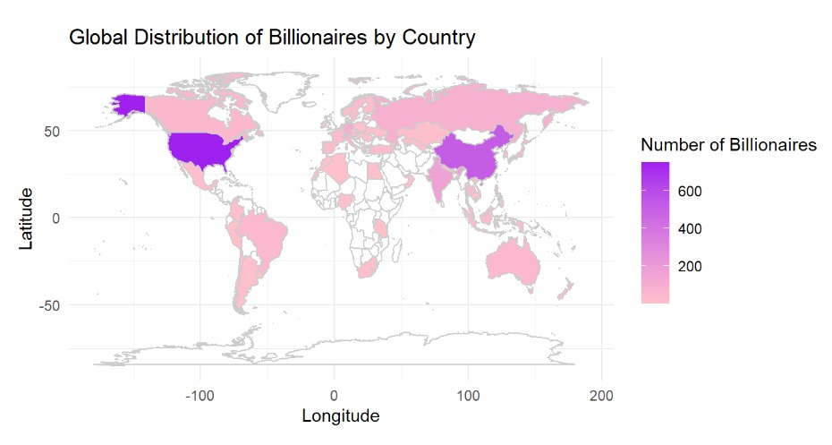
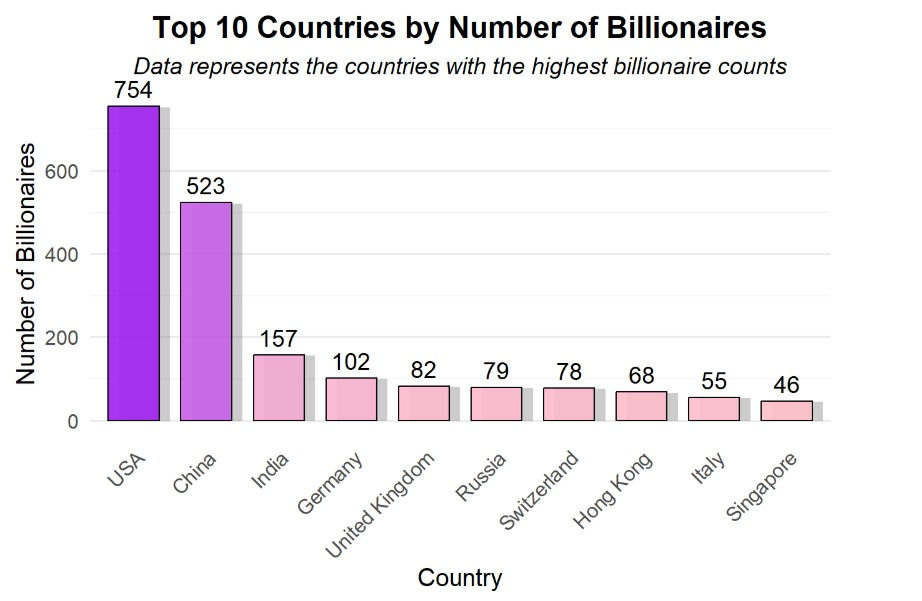
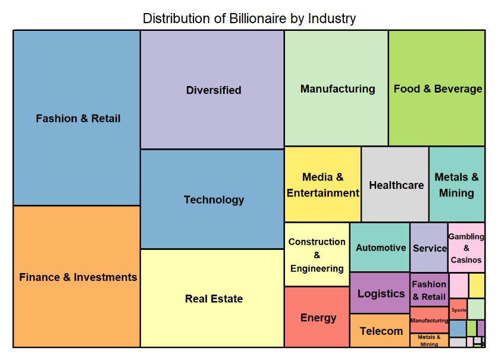

# Analysing Global Billionaires Distribution (2023)

**One-liner:** A clean, reproducible analysis of the **2023 global billionaire landscape** — countries, regional distribution, and industry composition — with a shareable report and notebook.

## What’s here
- `notebooks/` or `scripts/` — source analysis (EDA → wrangling → visuals). Use the notebook/script inside as your single source of truth.
- `report/` — compiled report (HTML/PDF) for quick viewing without a runtime.
- `data/` — processed data used for the visuals (keep original filenames).
- `Figures/` — exported charts used in the README and report.

> If you are browsing on GitHub, you can jump straight to the figures below for a quick overview.

## How to run
1. Open the project notebook/script from `notebooks/` (Jupyter Notebook / R Markdown / script).
2. Ensure the common data-vis stack is installed (e.g., **pandas/ggplot2**, **matplotlib/seaborn**, **sf/geopandas** depending on implementation).
3. Run all sections top-to-bottom to regenerate the figures into `Figures/`.

## Results (visuals)

**Figure 1 — Global Distribution of Billionaires by Country (Choropleth)**  
<p align="center">
  
</p>

**Figure 2 — Top 10 Countries by Number of Billionaires (Bar Chart)**  
<p align="center">
  
</p>

**Figure 3 — Distribution of Billionaires by Industry (Treemap)**  
<p align="center">
  
</p>

## Project scope
- **Goal:** Summarize and visualize where billionaires are located worldwide in 2023 and which **industries** dominate.
- **Workflow:** Clean data → enrich with country shapes / codes → compute country & industry aggregates → produce publication‑style charts.
- **Deliverables:** Reproducible notebook/script, compiled report (PDF/HTML), and exported figures under `Figures/`.

## Repo structure (suggested)
```
Analysing-Global-Billionaires-distribution-2023/
├─ data/
├─ notebooks/                 # or scripts/
├─ report/
├─ Figures/
│  ├─ output1.jpg             # world choropleth
│  ├─ output2.jpg             # top-10 bar chart
│  └─ output3.jpg             # industry treemap
└─ README.md
```

## Notes
- If you add new charts, export them into `Figures/` so they’re viewable on GitHub.
- Large raw datasets can be linked externally and ignored from version control if needed.

## Author
Lee Shan Yan
